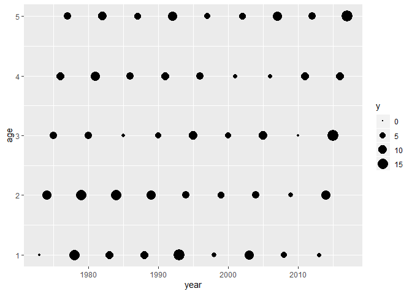
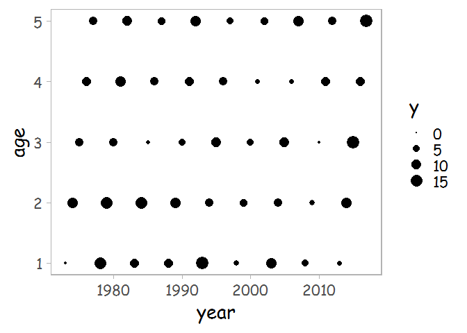
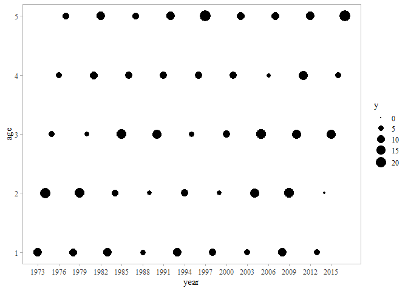
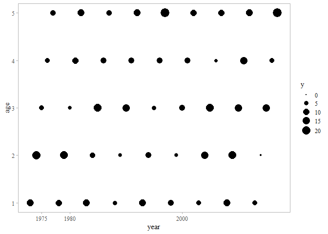
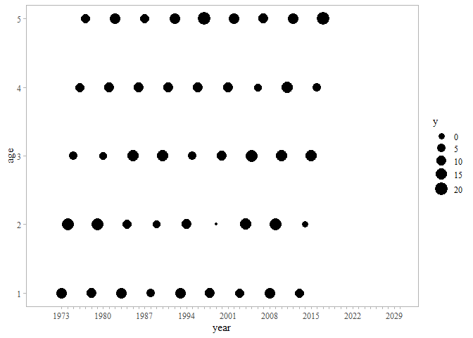

<!-- README.md is generated from README.Rmd. Please edit that file -->

# fngr

<!-- badges: start -->

<!-- badges: end -->

The goal of fngr is to help maintain consistency in figures developed
within ADF\&G.

## Installation

You can install the released version of fngr from
[GitHub](https://github.com/commfish) with:

``` r
# install.packages("devtools")
devtools::install_github("commfish/fngr")
```

## Example: theme\_report()

Load the package library per usual:

``` r
library(fngr)
library(tidyverse)
library(scales)
```

Create data for this example

``` r
data.frame(year = 1973:2017, age = 1:5) %>%
  mutate(y = rnorm(n(), 10, 5)) -> df
```

Base `ggplot` produces a figure with a grey background, white gridlines,
and no figure border. Further the font is not in Times New Roman
(standard for ADF\&G reports). There are some other characteristics
dealing with resolution etc that are explained in greater depth
[here](http://ben-williams.github.io/updated_ggplot_figures.html)

``` r
ggplot(df, aes(year, age, size = y)) + 
  geom_point()  + 
  scale_size_area()
```



To make all figures have the same apperance and font set the “universal”
figure theme to `theme_report()` (based off of Sean Anderson’s
[theme\_sleek()](https://github.com/seananderson/ggsidekick)).

``` r
theme_set(theme_report())
```

Create the same figure with the new theme settings. `theme_report()` is
set to generate figures with a Time New Roman 11 pt font.

``` r
ggplot(df, aes(year, age, size = y)) + 
  geom_point()  + 
  scale_size_area()
```


R comes with only a few fonts installed.

``` r
windowsFonts()
#> $serif
#> [1] "TT Times New Roman"
#> 
#> $sans
#> [1] "TT Arial"
#> 
#> $mono
#> [1] "TT Courier New"
#> 
#> $Times
#> [1] "TT Times New Roman"
```

Time New Roman is not a great font for presentations, and neither is a
11 pt font. These can be easily adjusted.

``` r
theme_set(theme_report(base_family = "sans", base_size = 18))

ggplot(df, aes(year, age, size = y)) + 
  geom_point()  + 
  scale_size_area()
```


More fonts are available via the `extrafont` package. This was loaded on
your machine along with the `fngr` package.

First you must load the available fonts (*Note that this must be done
every time you update R*). There are a lot of fonts (likely more than
necessary) and it will take a long time to load all of them.

``` r
# results of font_import() not shown
extrafont::font_import()
```

Once the fonts have loaded you can explore all of the available options.
This will generate a long list of available fonts (*Note you will need
to loadfonts() during every R session that you want to use somethinging
other than the base fonts*).

``` r
extrafont::loadfonts(device = "win")
```

Update the `base_family` font and `base_size` in the `theme_set()` if
you want something different than 11 pt.

``` r
theme_set(theme_report(base_family = "Comic Sans MS", base_size = 20))

ggplot(df, aes(year, age, size = y)) + 
  geom_point()  + 
  scale_size_area()
```



Revert back to the original `theme_report()` font.

``` r
theme_set(theme_report())
```

## Example: tickr()

The basic `ggplot` figure spaces years (x-axis) about every 5-10,
depending on the timeseries length. Note that there are not any tick
marks between the axis labels.

``` r
ggplot(df, aes(year, age, size = y)) + 
  geom_point()  + 
  scale_size_area()
```


One could manually define the axis breaks (ticks).

``` r
ggplot(df, aes(year, age, size = y)) + 
  geom_point()  + 
  scale_size_area() + 
  scale_x_continuous(breaks = seq(1973, 2017, 3))
```


Or use `pretty_breaks()` from the `scales` library.

``` r
ggplot(df, aes(year, age, size = y)) + 
  geom_point()  + 
  scale_size_area() +
  scale_x_continuous(breaks = scales::pretty_breaks(n = 15))
```



These provide more ticks and labels, but don’t place marks between the
labels.

Tick marks can be adjusted manually.

``` r
ggplot(df, aes(year, age, size = y)) + 
  geom_point()  + 
  scale_size_area() +
  scale_x_continuous(breaks = c(1975, 1980, 2000),
                     labels = c("1975", "1980", "2000"))
```


More clearly, but with greater difficulty each year can be assigned a
tickmark via `breaks =` and each tick mark is labeled via `labels =`.
This is a viable, though cludgy method.

``` r
ggplot(df, aes(year, age, size = y)) + 
  geom_point()  + 
  scale_size_area() +
  scale_x_continuous(breaks = 1973:2017,
                     labels = c(rep("", 2), "1975", rep("", 4), "1980", 
                                rep("", 4), "1985", rep("", 4), "1990", 
                                rep("", 4), "1995", rep("", 4), "2000", 
                                rep("", 4), "2005", rep("", 4), "2010", 
                                rep("", 4), "2015", rep("", 2)))
```



The `tickr()` function will provide tick marks for every year (or age)
and labels at a defined frequency.

Using `tickr()` the base level of labels is set at every 5th value.

``` r
xaxis = tickr(df, year)

ggplot(df, aes(year, age, size = y)) + 
  geom_point() +
  scale_x_continuous(breaks = xaxis$breaks, labels = xaxis$labels) 
```


This can be adjusted easily.

``` r
xaxis = tickr(df, year, 7)

ggplot(df, aes(year, age, size = y)) + 
  geom_point() +
  scale_x_continuous(breaks = xaxis$breaks, labels = xaxis$labels) 
```


Additionally start and end values can be defined.

``` r
xaxis = tickr(df, year, 7, start = 1973, end = 2014)

ggplot(df, aes(year, age, size = y)) + 
  geom_point() +
  scale_x_continuous(breaks = xaxis$breaks, labels = xaxis$labels) 
```


Just the start value.

``` r
xaxis = tickr(df, year, 7, start = 1977)

ggplot(df, aes(year, age, size = y)) + 
  geom_point() +
  scale_x_continuous(breaks = xaxis$breaks, labels = xaxis$labels) 
```


Just the end value.

``` r
xaxis = tickr(df, year, 7, end = 2010)

ggplot(df, aes(year, age, size = y)) + 
  geom_point() +
  scale_x_continuous(breaks = xaxis$breaks, labels = xaxis$labels) 
```


The start and end values can also be extended beyond the set axis by
adjusting the limits.

``` r
xaxis = tickr(df, year, 7, end = 2030)

ggplot(df, aes(year, age, size = y)) + 
  geom_point() +
  scale_x_continuous(breaks = xaxis$breaks, labels = xaxis$labels, limits = c(1970, 2030)) 
```


``` r
xaxis = tickr(df, year, 7, start = 1970, end = 2030)

ggplot(df, aes(year, age, size = y)) + 
  geom_point() +
  scale_x_continuous(breaks = xaxis$breaks, labels = xaxis$labels, limits = c(1970, 2030)) 
```


